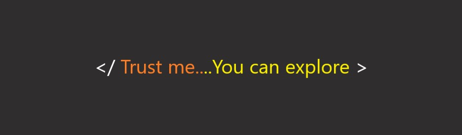

<!--
**pranavsuriya-sr/pranavsuriya-sr** is a ✨ _special_ ✨ repository because its `README.md` (this file) appears on your GitHub profile.

Here are some ideas to get you started:

- 🔭 I’m currently working on ...
- 🌱 I’m currently learning ...
- 👯 I’m looking to collaborate on ...
- 🤔 I’m looking for help with ...
- 💬 Ask me about ...
- 📫 How to reach me: ...
- 😄 Pronouns: ...
- ⚡ Fun fact: ...
-->
------

------

# Hi there 👋

I am Pranav Suriya. Currently pursuing BTech in Electrical 🔌 And Computer 💻 Engineering from Amrita Vishwa Vidyapeetham University. To know more about me, view my portfolio here https://pranavsuriya-sr.github.io/personalPortfolio/ .

------

## Active on Open Source Events and platforms.
Languages that I use include
 

## Tools

Find me on

&nbsp;&nbsp;  &nbsp;&nbsp; &nbsp; &nbsp;

-----

## &#x1f4c8; GitHub Stats
<!--

	 -->
  

-------

<!---->

## 📱 Connect with me
 &nbsp;     &nbsp;

